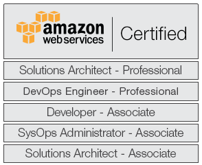

#### I am a Senior Systems Architect and Cloud Computing Expert, certified by Amazon Web Services as Solutions Architect, DevOps Engineer, SysOps Administrator and Developer (AWS Certified All 5 Group).

#### In this page you can find tools and small projects implemented by me. Go in and feel free to help yourself!

# Current Projects

* [EC2-AMIs tool](https://github.com/rubenmromero/ec2-amis)
* [Git-Matrix script](https://github.com/rubenmromero/git-matrix)
* [Bitbucket-Jenkins-Connector web service](https://github.com/rubenmromero/bitbucket-jenkins-connector)
* [Files-S3-Backup tool](https://github.com/rubenmromero/files-s3-backup)

#### View my [profile](https://es.linkedin.com/in/rubenmromero) and connect with me on LinkedIn
